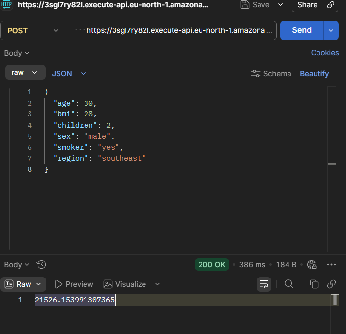
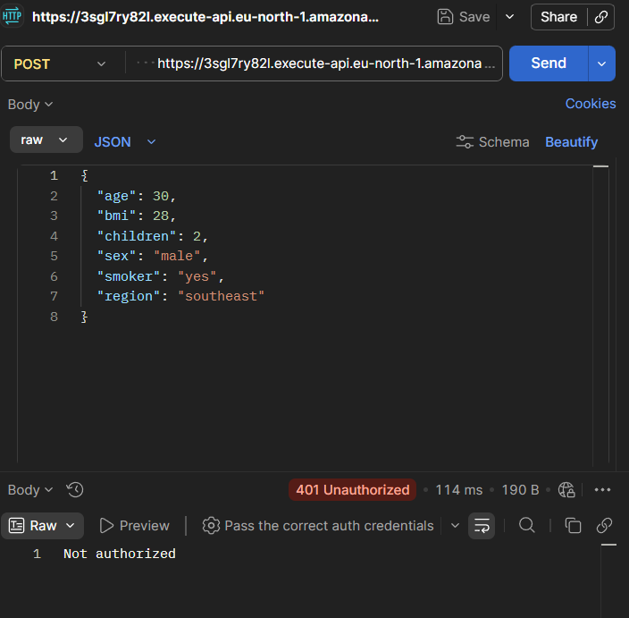

# Insurance Cost Predictor — Linear Regression, Deployed on AWS

An end-to-end machine learning project that predicts medical insurance charges using **Linear Regression**, deployed as a live, publicly callable API on **AWS Lambda + API Gateway**.

This project covers the full pipeline: raw data → EDA → feature engineering → model training → evaluation → a hand-derived pure-Python inference function → cloud deployment → security hardening.

---

## Dataset

[Medical Cost Personal Dataset](https://www.kaggle.com/datasets/mirichoi0218/insurance) (Kaggle) — 1,338 records with `age`, `sex`, `bmi`, `children`, `smoker`, `region`, and `charges`.

## Problem

Predict `charges` (a continuous value) using a person's demographic and health information.

---

## Pipeline

### 1. EDA & Outlier Handling
Explored distributions and relationships between features and `charges`. Removed BMI outliers using the IQR method.

### 2. Feature Engineering
A strip plot of `bmi` vs `charges`, colored by `smoker` status, revealed that BMI has almost no effect on charges for non-smokers, but a sharp jump in cost for smokers once BMI crosses roughly 30 (the clinical "obese" threshold). This looked more like a threshold effect than a smooth interaction — but a `bmi * smoker` interaction term was added and tested anyway, since it's the standard way to let a linear model represent *some* combined effect between two features that plain addition can't capture.

### 3. Preprocessing
- Train/test split performed **before** any encoding, to avoid data leakage.
- Categorical features (`sex`, `region`) encoded with `OneHotEncoder(drop='first')`, fit only on the training set.
- Numeric features (`age`, `bmi`, `children`, `bmi_smoker`) combined with the encoded categoricals via `np.hstack`.

### 4. Model Training & Evaluation

| Version | R² | MSE | MAPE |
|---|---|---|---|
| Buggy (numeric columns accidentally dropped) | 0.31 | 37,379,518 | 81.8% |
| Fixed (numeric + categorical combined correctly) | 0.51 | 26,466,504 | 29.1% |
| + `bmi_smoker` interaction term | **0.53** | **25,204,193** | **28.2%** |

**Note on the debugging process:** an early version of the pipeline accidentally overwrote the training data with only the encoded categorical columns, silently dropping `age`, `bmi`, and `children` from the model. This was caught by noticing the model only had 3 coefficients instead of 8, and fixed by keeping numeric and encoded categorical arrays separate before combining them with `hstack`.

**Honest take on model performance:** R² of 0.53 is a reasonable but not exceptional result for plain linear regression on this dataset. The interaction term only produced a modest gain because it models a smooth multiplicative relationship, while the real pattern (visible in the strip plot) looks more like a step function around BMI = 30. Capturing that properly would need a different feature (e.g., a binary "smoker AND obese" flag) or a non-linear model.

### 5. Inference Function
A validated `predict_new_input()` function handles raw input, with explicit checks for:
- Invalid `smoker` values (must be exactly "yes"/"no")
- Invalid `region` (must be one of the four known categories)
- Invalid `sex` (must be "female"/"male")
- Out-of-range `age` (0–120) and `bmi` (0–100)

This was built by deliberately testing edge cases (invalid region, negative age, BMI of 0) and discovering that `OneHotEncoder(handle_unknown='ignore')` silently encodes unknown categories as all-zeros — which is mathematically identical to the encoder's dropped baseline category. Without explicit validation, a typo like `region="northamerica"` would have been silently treated as `region="northeast"` and produced a confident, wrong prediction.

---

## Deployment

**Stack:** AWS Lambda + API Gateway (HTTP API)

### Why not just call `lr.predict()` in Lambda?

The original plan was to deploy the trained `scikit-learn` model directly, loading it with `joblib` inside Lambda. This hit a hard wall: `numpy` + `scipy` + `scikit-learn`, installed for Lambda's Linux runtime, came to **~250MB** — right at (and effectively over, once code and model files were added) Lambda's 250MB unzipped package limit. This is a well-documented pain point, not a one-off mistake — scikit-learn's dependency footprint is simply too large for standard Lambda packaging.

**The fix:** since the model is plain Linear Regression, a trained model is just a set of coefficients and an intercept — a weighted sum. The `lr.coef_` and `lr.intercept_` values were extracted once and hardcoded into a pure-Python reimplementation of the prediction formula:

```
charges = (249.84 × age) + (43.13 × bmi) + (427.43 × children) + (565.29 × bmi_smoker)
        + (-245.30 × sex_male) + (-175.42 × region_northwest)
        + (-785.37 × region_southeast) + (-823.29 × region_southwest)
        + (-2829.13)
```

This eliminated every external dependency. The final Lambda package is a single `.py` file with **zero imports beyond the standard library** — no packaging problem, no platform-compatibility issues, no size limit concerns.

### API Gateway integration notes
- API Gateway wraps the actual request payload inside `event["body"]` **as a JSON string**, not as a top-level dictionary — this required unpacking with `json.loads(event["body"])` before the input values could be accessed.
- **HTTP API** (used here, over the older REST API) is cheaper and simpler, but does not support AWS's native API key/usage-plan feature — that's a REST-API-only capability. A custom header-based key check (header name: `private-key`) was implemented directly inside the Lambda function instead, as a lightweight equivalent for this project's scale.

### Live test — valid request
Called from Postman, external to AWS entirely, with a valid payload and the correct `private-key` header:



`200 OK` — returns a predicted charge of `21526.15...`, matching the local pure-Python calculation exactly.

### Live test — unauthorized request


Sending the same request without a valid `private-key` header returns `401 Unauthorized`, `"Not authorized"` — this is the custom check inside `lambda_handler` rejecting the request before it reaches the prediction logic, confirming the key requirement works as intended.

---

## What I'd do differently in production
- Use AWS Secrets Manager (or at least environment variables) instead of a hardcoded key string in code.
- Add CloudWatch-based logging of incoming requests for monitoring.
- Consider a non-linear model or a threshold-based feature to better capture the smoker × BMI relationship observed in EDA.

## Tech stack
Python, pandas, scikit-learn (training only), seaborn/matplotlib (EDA), AWS Lambda, AWS API Gateway, Postman (testing)
